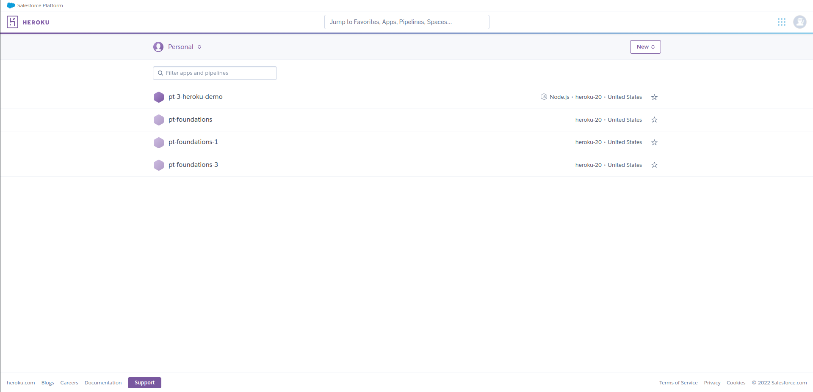
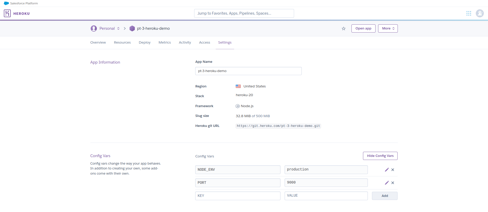

# Heroku Deployment Demo

## Requirements
1. Node.js v14+
2. NPM v6+

## Project Dependencies
- `dotenv` for loading in environment variables
- `express` for creating the web server
- `heroku` for interacting with and pushing to Heroku
- `nodemon` for running server in development mode

### Steps
1. Create application in [Heroku Dashboard](https://dashboard.heroku.com/apps)

2. Add config vars in Heroku under the **Settings** tab

    - PORT
    - NODE_ENV
3. `yarn heroku login`
4. `yarn heroku git:clone -a replace-with-app-name`
    - Example: `yarn heroku git:clone -a pt-3-heroku-demo`
5. `git push heroku main`